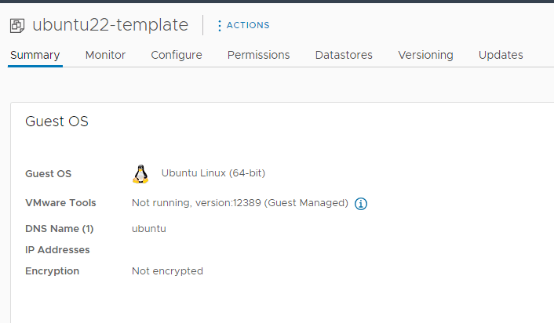
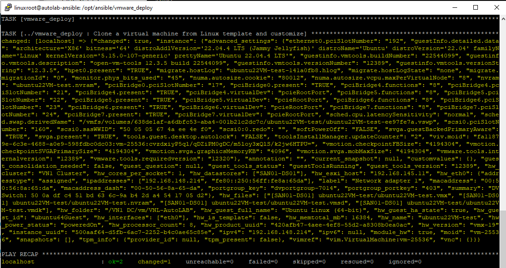
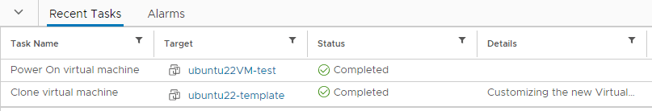
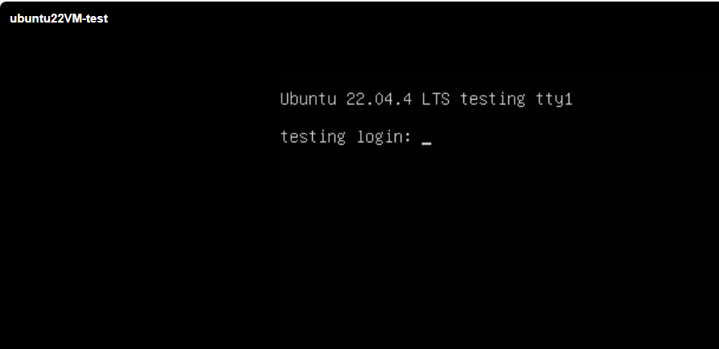

VM Template name:



running:
```bash
ansible-playbook -i inventory.ini -e "vm_name=ubuntu22VM-test" -e "template_name=ubuntu22-template" -e "vm_hostname=testing" -e "@vars.yml" playbook.yml -v
```




